# Taostats subnet Widget

### Small

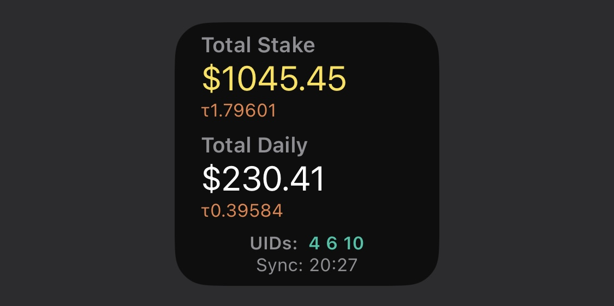

### Medium

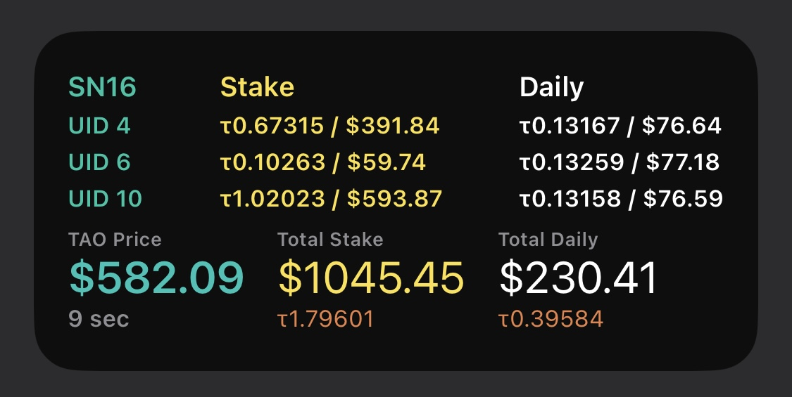

### Large

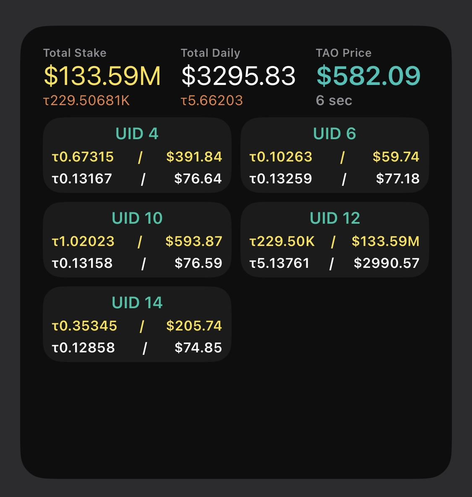

## Setup

### 1. Download free app from AppStore

Scriptable app: https://apps.apple.com/app/id1405459188

### 2. Download our script

Ready to add .scriptable: [Taostats widget V6.scriptable](https://github.com/ye-du-dev/Taostats-Scriptable/blob/main/Taostats%20widget%20V6.scriptable)

### 3. Add script to app

Go to downloaded .scriptable

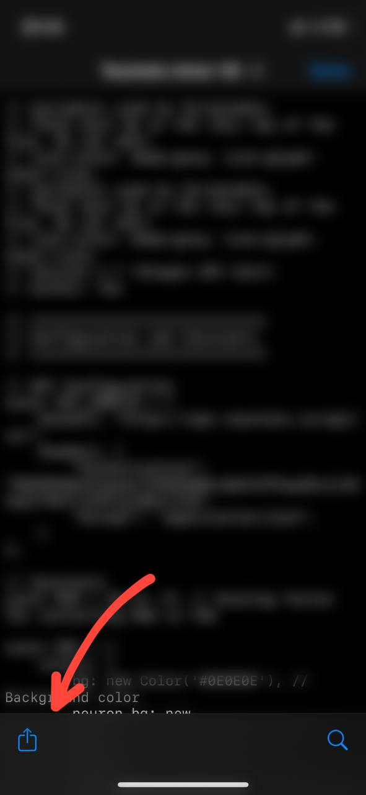
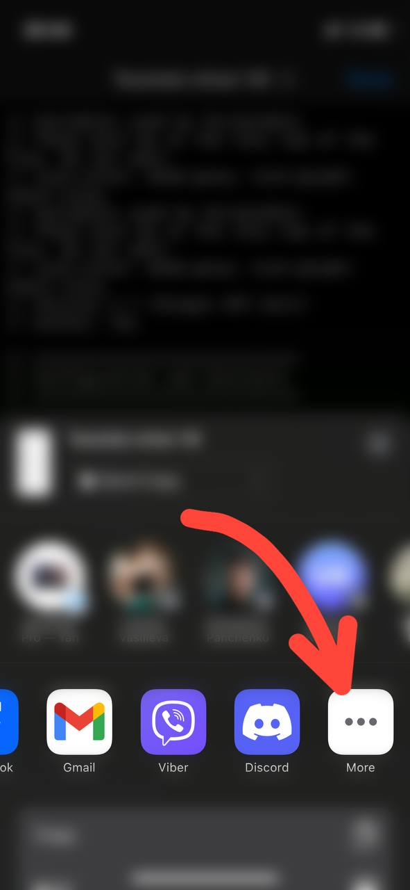
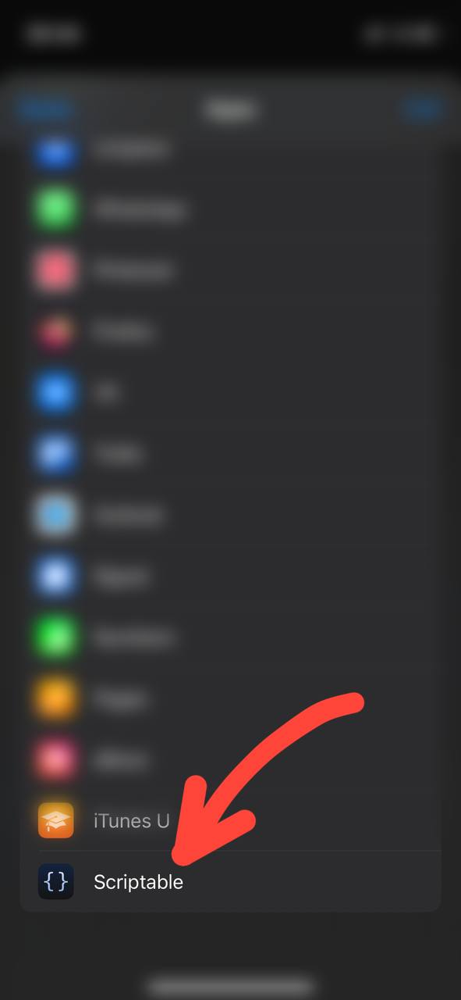
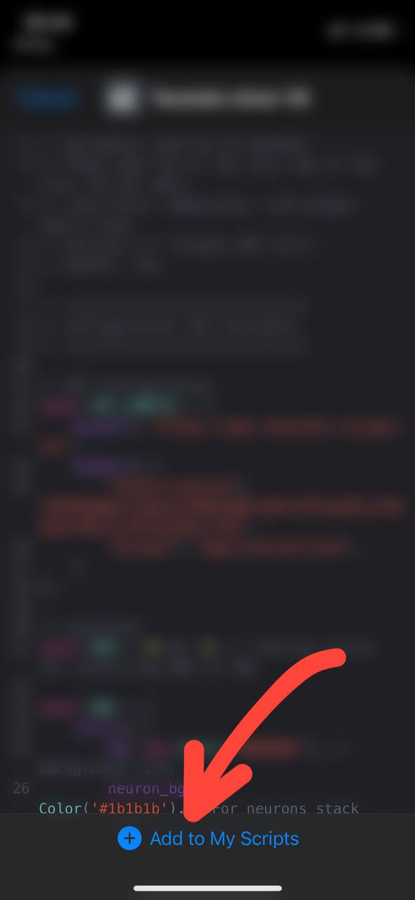

### 4. Add Widget to home screen

 Long press on home screen. Tap Edit. Tap Add Widget. 
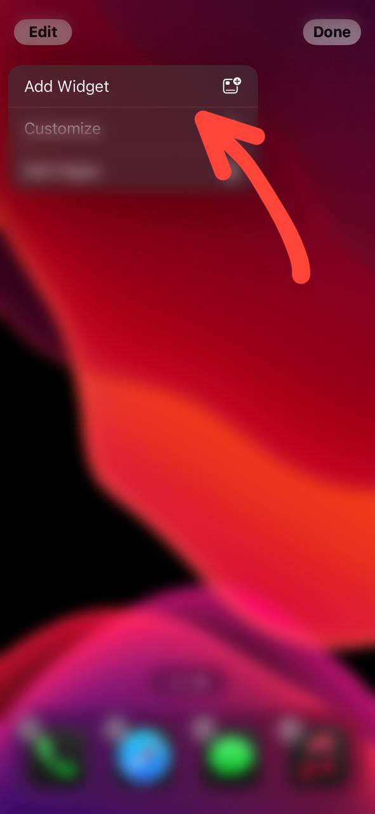
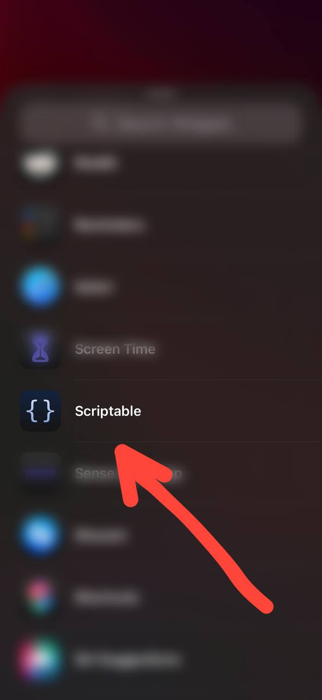
 Select any widget size 
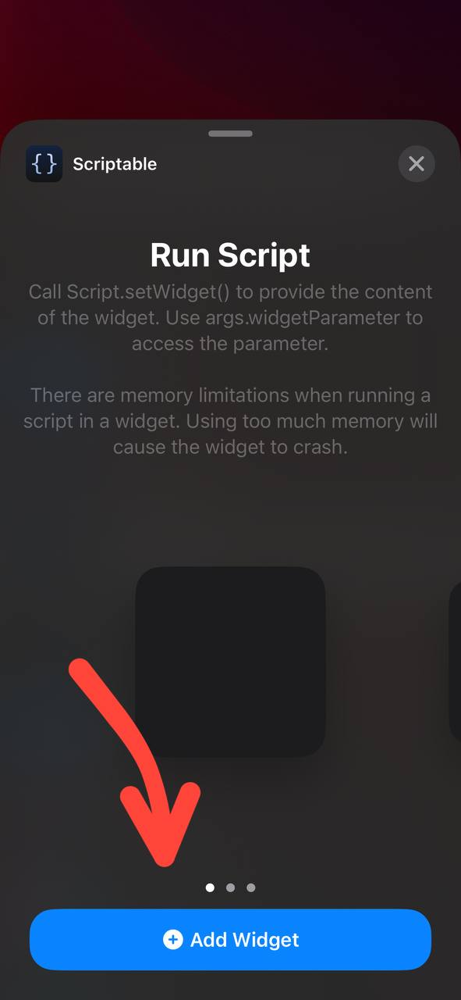
 Long press on widget. Tap Edit Widget. 
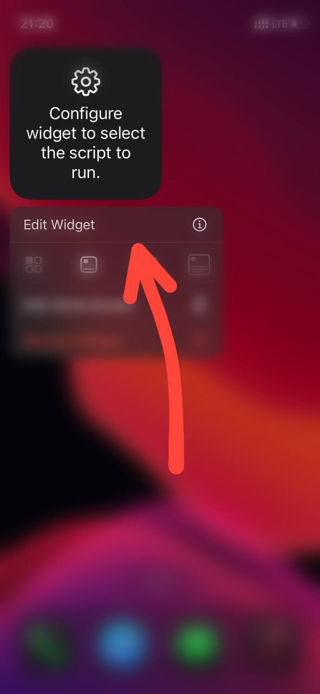
 Select our script. Type parameters where: very first param is your subnet id, next are your uids. 
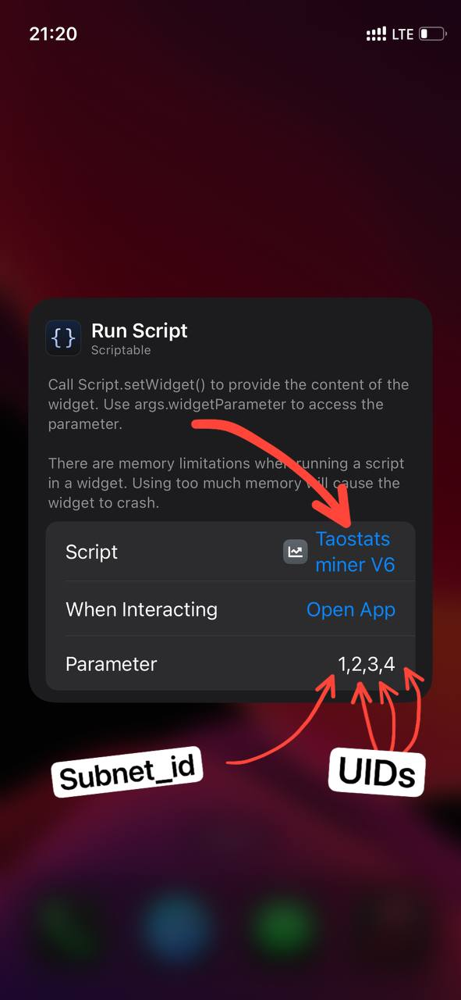
 You can search for your subnet id here: https://taostats.io/subnets 